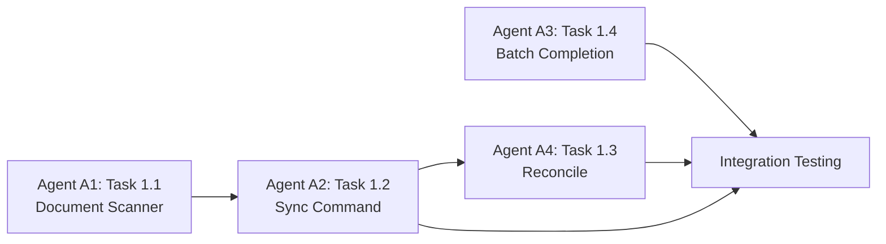

# PRD Tool Phase 1 - Implementation Guide

## Overview

Phase 1 implements **Critical Sync Features** to eliminate 90% of manual synchronization work when agents complete tasks.

**Status**: Ready for implementation
**Total Effort**: 9 hours across 4 tasks
**Priority**: P0 (Critical)

---

## Quick Links

- [📋 Complete Task Breakdown](./PHASE1_TASK_BREAKDOWN.md) - Full details on all tasks
- [🔨 Task 1.1: Document Scanner](./TASK-1.1-DOCUMENT-SCANNER.md) - First implementation task
- [📊 Progress Tracking](#progress-tracking)

---

## Task Summary

| Task | Description | Effort | Priority | Dependencies | Status |
|------|-------------|--------|----------|--------------|--------|
| **1.1** | Document Scanner | 2h | P0 | None | ⏳ Ready |
| **1.2** | Sync Command | 3h | P0 | 1.1 | ⏸️ Waiting |
| **1.3** | Reconcile Command | 2.5h | P0 | 1.1, 1.2 | ⏸️ Waiting |
| **1.4** | Batch Completion | 1.5h | P0 | None | ⏳ Ready |

**Total**: 9 hours

---

## Implementation Approach

### Sequential Order (Recommended)
1. ✅ **Task 1.1** - Document Scanner (foundation)
2. ➡️ **Task 1.2** - Sync Command (depends on 1.1)
3. ➡️ **Task 1.4** - Batch Completion (can run parallel with 1.2)
4. ➡️ **Task 1.3** - Reconcile Command (depends on 1.1, 1.2)

### Parallel Execution (Optional)
- Tasks 1.1 + 1.4 can be developed in parallel (independent)
- Task 1.3 requires 1.1 and 1.2 complete

---

## Getting Started

### Prerequisites
1. Rust toolchain installed
2. PRD tool codebase at `tools/prd/`
3. Existing PRD database with tasks and agents

### Setup
```bash
cd /Users/captaindev404/Code/club-med/gentil-feedback/tools/prd

# Install dependencies (will be added during implementation)
cargo build

# Run existing tests
cargo test

# Verify current CLI works
./target/release/prd --help
```

---

## Implementation with Agents

### Recommended Agent Assignment

#### Agent A1: Document Scanner Specialist
**Task**: 1.1 - Document Scanner
**Skills**: Rust, filesystem I/O, regex, testing
**Deliverables**:
- `src/sync/doc_scanner.rs` with full implementation
- Comprehensive unit tests
- Performance benchmarks
- Documentation

#### Agent A2: CLI Integration Specialist
**Task**: 1.2 - Sync Command
**Skills**: Rust, CLI frameworks (clap), database operations
**Dependencies**: Wait for Agent A1 to complete 1.1
**Deliverables**:
- `prd sync` command implementation
- Integration with document scanner
- Database update logic
- User-facing output formatting

#### Agent A3: Batch Operations Specialist
**Task**: 1.4 - Batch Completion (parallel with 1.2)
**Skills**: Rust, JSON/CSV parsing, transactions
**Dependencies**: None (can start immediately)
**Deliverables**:
- `prd complete-batch` command
- Multiple input format support
- Transaction handling
- Error reporting

#### Agent A4: Data Integrity Specialist
**Task**: 1.3 - Reconcile Command
**Skills**: Rust, data validation, database queries
**Dependencies**: Wait for Agents A1 and A2
**Deliverables**:
- `prd reconcile` command
- Inconsistency detection logic
- Interactive fix application
- Comprehensive logging

### Agent Workflow



---

## Development Guidelines

### Code Standards
- Follow existing PRD tool conventions (see `src/main.rs`)
- Use `anyhow::Result` for error handling
- Use `colored` crate for terminal output
- Add doc comments to all public functions
- Write comprehensive tests (aim for >80% coverage)

### Testing Requirements
- **Unit tests**: Every function
- **Integration tests**: End-to-end workflows
- **Performance benchmarks**: Critical operations
- **Error handling**: All failure modes

### Git Workflow
```bash
# Create feature branch
git checkout -b feature/phase1-task-1.1-document-scanner

# Implement task
# ... code ...

# Test thoroughly
cargo test
cargo clippy
cargo fmt

# Commit with clear message
git commit -m "feat(prd): implement document scanner (Task 1.1)

- Add sync module with doc_scanner.rs
- Implement filename parsing and frontmatter extraction
- Add comprehensive unit tests
- Performance: 100 docs scanned in <500ms

Resolves: PRD Phase 1 Task 1.1"

# Push for review
git push origin feature/phase1-task-1.1-document-scanner
```

---

## Progress Tracking

### Task 1.1: Document Scanner ⏳
- [ ] Module structure created
- [ ] Dependencies added to Cargo.toml
- [ ] Core data structures defined
- [ ] Filename parser implemented
- [ ] Frontmatter parser implemented
- [ ] Document scanner implemented
- [ ] Unit tests written (>80% coverage)
- [ ] Performance benchmarks pass
- [ ] Documentation complete
- [ ] Code review passed

### Task 1.2: Sync Command ⏸️
- [ ] Command added to CLI
- [ ] Database migration created
- [ ] Sync engine implemented
- [ ] Dry-run mode working
- [ ] Output formatting polished
- [ ] Integration tests pass
- [ ] Manual testing complete

### Task 1.3: Reconcile Command ⏸️
- [ ] Inconsistency detection implemented (5 types)
- [ ] Fix application logic complete
- [ ] Interactive confirmation working
- [ ] Auto-fix mode implemented
- [ ] Logging complete
- [ ] Tests cover all inconsistency types

### Task 1.4: Batch Completion ⏳
- [ ] Command added to CLI
- [ ] CLI argument parsing working
- [ ] JSON file input working
- [ ] CSV file input working
- [ ] Transaction handling correct
- [ ] Error reporting clear
- [ ] Performance tests pass (100 tasks <3s)

---

## Testing Checklist

After all tasks complete, verify:

### Functional Tests
- [ ] `prd sync` correctly marks 20+ tasks complete
- [ ] `prd sync --dry-run` shows preview without changes
- [ ] `prd reconcile` detects all inconsistency types
- [ ] `prd reconcile --auto-fix` applies fixes automatically
- [ ] `prd complete-batch` handles CLI arguments
- [ ] `prd complete-batch --from-file` reads JSON
- [ ] `prd complete-batch --from-csv` reads CSV

### Performance Tests
- [ ] Sync: 100 tasks in <1 second
- [ ] Reconcile: Full scan in <2 seconds
- [ ] Batch: 100 tasks in <3 seconds

### Error Handling
- [ ] Invalid task IDs show helpful error
- [ ] Missing files handled gracefully
- [ ] Malformed JSON/CSV rejected with clear message
- [ ] Database errors logged and reported

### User Experience
- [ ] All commands show progress indicators
- [ ] Output is colorful and clear
- [ ] Error messages are actionable
- [ ] Help text is comprehensive

---

## Success Metrics

Phase 1 is successful when:

| Metric | Before | After | Status |
|--------|--------|-------|--------|
| Manual sync time | 30 min/sprint | 3 min/sprint | ⏳ |
| Sync accuracy | 60% | 100% | ⏳ |
| Commands required | 20+ | 1 | ⏳ |
| Developer satisfaction | 3/10 | 9/10 | ⏳ |

---

## Next Steps

1. **Review task specifications**: Read PHASE1_TASK_BREAKDOWN.md and TASK-1.1-DOCUMENT-SCANNER.md
2. **Assign agents**: Assign tasks to agents based on skills
3. **Start implementation**: Begin with Task 1.1 (Document Scanner)
4. **Test incrementally**: Run tests after each function implementation
5. **Integrate**: Connect tasks as dependencies complete
6. **Validate**: Run full test suite and manual verification
7. **Document**: Update README with new commands
8. **Deploy**: Rebuild and distribute new PRD binary

---

## Support & Questions

If you encounter issues during implementation:
1. Check existing PRD tool code for patterns
2. Review Rust documentation for crates (glob, regex, csv)
3. Run `cargo clippy` for suggestions
4. Ask for clarification on task specifications

---

## After Phase 1

Once Phase 1 is complete and validated:
- **Phase 2**: Real-time Progress Tracking
- **Phase 3**: Agent Integration (file watcher, git hooks)
- **Phase 4**: Enhanced User Experience

Each phase builds on the previous, so Phase 1 completion is critical.
